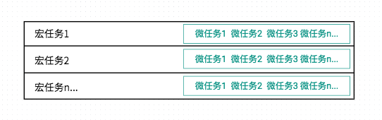
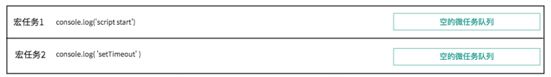
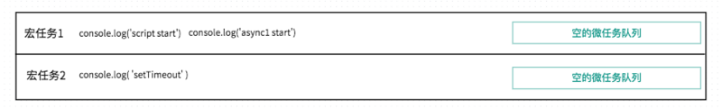
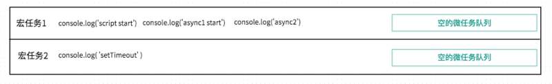
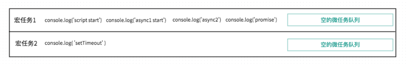
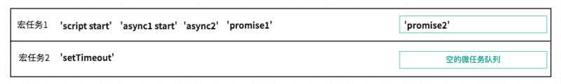
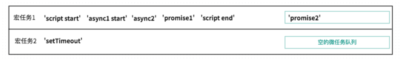
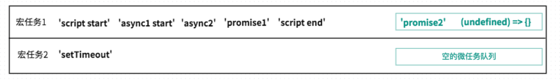

## 为什么写这篇文章？

说实话，关于js的异步执行顺序，宏任务、微任务这些，或者async/await这些慨念已经有非常多的文章写了。

但是怎么说呢，简单来说，业务中很少用async，不太懂async呢。

研究了一天，感觉懂了，所手痒想写一篇 ，哈哈。

毕竟自己学会的知识，如果连表达清楚都做不到，怎么能指望自己用好它呢？

## 测试一下自己有没有必要看

所以我写这个的文章，主要还是交流学习，如果您已经清楚了eventloop/async/await/promise这些东西呢，可以 break 啦

``` bash
async function async1() {
    console.log("async1 start");
    await async2();
    console.log("async1 end");
}

async function async2() {
    console.log("async2");
}

console.log("script start");

setTimeout(function() {
    console.log("setTimeout");
}, 0);

async1();

new Promise(function(resolve) {
    console.log("promise1");
    resolve();
}).then(function() {
    console.log("promise2");
});

console.log("script end");
```

> 注：因为是一道前端面试题，所以答案是以浏览器的eventloop机制为准的，在node平台上运行会有差异。

``` bash
script start
async1 start
async2
promise1
script end
promise2
async1 end
setTimeout
```

## 需要具备的前置知识

> * promise的使用经验
> * 浏览器端的eventloop

那么如果不具备这些知识呢，推荐几篇我觉得讲得比较清楚的文章

> * [《10分钟理解JS引擎的执行机制》](https://segmentfault.com/a/1190000012806637)：这是我之前写的讲解eventloop的文章，我觉得还算清晰，但是没涉及 async
> * [《理解 JavaScript 的 async/await》](https://segmentfault.com/a/1190000007535316)：这是我读过的讲async await最清楚的文章
> * 《ECMAScript 6 入门 - Promise 对象》：promise就推荐阮一峰老师的ES6吧，不过不熟悉 promise 的应该较少啦。

## 主要内容

### 第1部分：对于async await的理解

> * async 做一件什么事情？
> * await 在等什么？
> * await 等到之后，做了一件什么事情？
> * async/await 比 promise有哪些优势？（回头补充）

#### async 做一件什么事情？

**带 async 关键字的函数，它使得你的函数的返回值必定是 promise 对象**

也就是

如果async关键字函数返回的不是promise，会自动用Promise.resolve()包装

如果async关键字函数显式地返回promise，那就以你返回的promise为准

这是一个简单的例子，可以看到 async 关键字函数和普通函数的返回值的区别

``` bash
async function fn1(){
    return 123
}

function fn2(){
    return 123
}

console.log(fn1())
console.log(fn2())

Promise {<resolved>: 123}
123
```

所以你看，async 函数也没啥了不起的，以后看到带有 async 关键字的函数也不用慌张，你就想它无非就是把return值包装了一下，其他就跟普通函数一样。

关于async关键字还有那些要注意的？

> * 在语义上要理解，async表示函数内部有异步操作
> * 另外注意，一般 await 关键字要在 async 关键字函数的内部，await 写在外面会报错。

#### await 在等什么？

**await等的是右侧「表达式」的结果**

也就是说，

右侧如果是函数，那么函数的return值就是「表达式的结果」

右侧如果是一个 ‘hello’ 或者什么值，那表达式的结果就是 ‘hello’

``` bash
async function async1() {
    console.log( 'async1 start' )
    await async2()
    console.log( 'async1 end' )
}
async function async2() {
    console.log( 'async2' )
}
async1()
console.log( 'script start' )
```
结果
``` bash
async1 start
async2
script start
async1 end
```

这里注意一点，可能大家都知道await会让出线程，阻塞后面的代码，那么上面例子中， ‘async2’ 和 ‘script start’ 谁先打印呢？

是从左向右执行，一旦碰到await直接跳出, 阻塞async2()的执行？

还是从右向左，先执行async2后，发现有await关键字，于是让出线程，阻塞代码呢？

**实践的结论是，从右向左的。先打印async2，后打印的script start**

之所以提一嘴，是因为我经常看到这样的说法，「一旦遇到await就立刻让出线程，阻塞后面的代码」

这样的说法，会让我误以为，await后面那个函数， async2()也直接被阻塞呢。

await 等到之后，做了一件什么事情？
那么右侧表达式的结果，就是await要等的东西。

等到之后，对于await来说，分2个情况

> * 不是promise对象
> * 是promise对象

**如果不是 promise , await会阻塞后面的代码，先执行async外面的同步代码，同步代码执行完，再回到async内部，把这个非promise的东西，作为 await表达式的结果**

**如果它等到的是一个 promise 对象，await 也会暂停async后面的代码，先执行async外面的同步代码，等着 Promise 对象 fulfilled，然后把 resolve 的参数作为 await 表达式的运算结果。**

### 第2部分：画图一步步看清宏任务、微任务的执行过程

我们以开篇的经典面试题为例，分析这个例子中的宏任务和微任务。

``` bash
async function async1() {
    console.log("async1 start");
    await async2();
    console.log("async1 end");
}

async function async2() {
    console.log("async2");
}

console.log("script start");

setTimeout(function() {
    console.log("setTimeout");
}, 0);

async1();

new Promise(function(resolve) {
    console.log("promise1");
    resolve();
}).then(function() {
    console.log("promise2");
});

console.log("script end");
```

先分享一个我个人理解的宏任务和微任务的慨念，在我脑海中宏任务和为微任务如图所示



也就是「宏任务」、「微任务」都是队列。

一段代码执行时，会先执行宏任务中的同步代码，

如果执行中遇到setTimeout之类宏任务，那么就把这个setTimeout内部的函数推入「宏任务的队列」中，下一轮宏任务执行时调用。
如果执行中遇到promise.then()之类的微任务，就会推入到「当前宏任务的微任务队列」中，在本轮宏任务的同步代码执行都完成后，依次执行所有的微任务1、2、3
下面就以面试题为例子，分析这段代码的执行顺序。

每次宏任务和微任务发生变化，我都会画一个图来表示他们的变化

**直接打印同步代码 console.log(‘script start’)**

``` bash
// 首先是2个函数声明，虽然有async关键字，但不是调用我们就不看。然后首先是打印同步代码 
console.log('script start')
```


**将setTimeout放入宏任务队列**

默认所包裹的代码，其实可以理解为是第一个宏任务，所以这里是宏任务2



**调用async1，打印 同步代码 console.log( ‘async1 start’ )**

我们说过看到带有async关键字的函数，不用害怕，它的仅仅是把return值包装成了promise，其他并没有什么不同的地方。所以就很普通的打印 console.log( ‘async1 start’ )



**分析一下 await async2()**

前文提过await，1.它先计算出右侧的结果，2.然后看到await后，中断async函数

> * 先得到await右侧表达式的结果。执行async2()，打印同步代码console.log(‘async2’), 并且return Promise.resolve(undefined)
> * await后，中断async函数，先执行async外的同步代码

目前就直接打印 console.log(‘async2’)



**被阻塞后，要执行async之外的代码**

执行new Promise()，Promise构造函数是直接调用的同步代码，所以 console.log( ‘promise1’ )



**代码运行到promise.then()**

代码运行到promise.then()，发现这个是微任务，所以暂时不打印，只是推入当前宏任务的微任务队列中。

**注意：这里只是把promise2推入微任务队列，并没有执行。微任务会在当前宏任务的同步代码执行完毕，才会依次执行**



**打印同步代码 console.log(‘script end’)**

没什么好说的。执行完这个同步代码后，「async外的代码」终于走了一遍

下面该回到 await 表达式那里，执行await Promise.resolve(undefined)了

**回到async内部，执行await Promise.resolve(undefined)**

这部分可能不太好理解，我尽量表达我的想法。

对于 await Promise.resolve(undefined) 如何理解呢？

根据 MDN 原话我们知道

**如果一个 Promise 被传递给一个 await 操作符，await 将等待 Promise 正常处理完成并返回其处理结果。**

在我们这个例子中，就是Promise.resolve(undefined)正常处理完成，并返回其处理结果。那么await async2()就算是执行结束了。

目前这个promise的状态是fulfilled，等其处理结果返回就可以执行await下面的代码了。

那何时能拿到处理结果呢？

回忆平时我们用promise，调用resolve后，何时能拿到处理结果？是不是需要在then的第一个参数里，才能拿到结果。

（调用resolve时，会把then的参数推入微任务队列，等主线程空闲时，再调用它）

所以这里的 await Promise.resolve() 就类似于



把then的第一个回调参数 (undefined) => {} 推入微任务队列。

then执行完，才是await async2()执行结束。

await async2()执行结束，才能继续执行后面的代码

如图



此时当前宏任务1都执行完了，要处理微任务队列里的代码。

**微任务队列，先进选出的原则**

> * 执行微任务1，打印promise2
> * 执行微任务2，没什么内容..

但是微任务2执行后，await async2()语句结束，后面的代码不再被阻塞，所以打印

console.log(‘async1 end’)

宏任务1执行完成后,执行宏任务2

宏任务2的执行比较简单，就是打印

console.log(‘setTimeout’)

至此完结


补充：

``` bash
{
async function async1() {
    console.log("async start")
    await async2()
    console.log("async end")
}

function async2() { // 变成同步函数，区别于例子
    console.log("async2")
}

console.log("start")

async1()

setTimeout(function() {
    console.log("setTimeout start")
}, 0)

new Promise(function(resolve) {
    console.log("promise1")
    resolve();
}).then(() => {
    console.log("promise2")
})

console.log("script end")

}
```

结果

``` bash
start
async start
async2
promise1
script end
async end
promise2
setTimeout start
```
