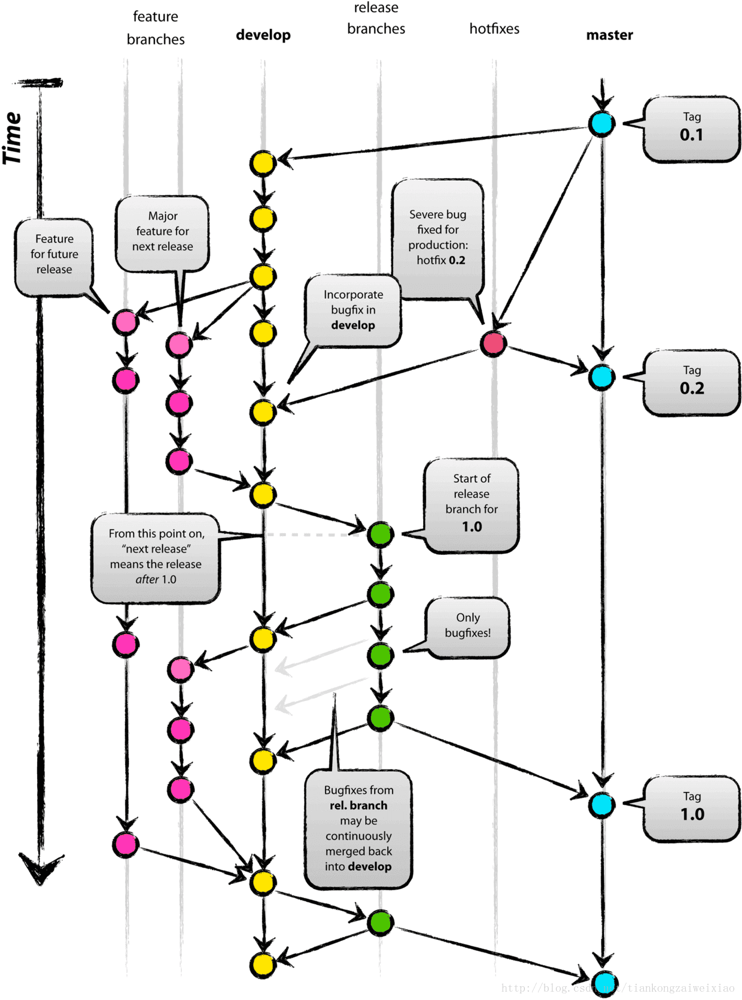

# 介绍

Gitflow工作流定义了一个围绕项目发布的严格分支模型。虽然比功能分支工作流复杂几分，但提供了用于一个健壮的用于管理大型项目的框架。

Gitflow工作流没有用超出功能分支工作流的概念和命令，而是为不同的分支分配一个很明确的角色，并定义分支之间如何和什么时候进行交互。除了使用功能分支，在做准备、维护和记录发布也使用各自的分支。当然你可以用上功能分支工作流所有的好处：Pull Requests、隔离实验性开发和更高效的协作。

# 工作方式

Gitflow工作流仍然用中央仓库作为所有开发者的交互中心。和其它的工作流一样，开发者在本地工作并push分支到要中央仓库中。

## 功能分支

相对使用仅有的一个master分支，Gitflow工作流使用2个分支来记录项目的历史。master分支存储了正式发布的历史，而develop分支作为功能的集成分支。这样也方便master分支上的所有提交分配一个版本号。

剩下要说明的问题围绕着这2个分支的区别展开。

## 发布分支

每个新功能位于一个自己的分支，这样可以push到中央仓库以备份和协作。但功能分支不是从master分支上拉出新分支，而是使用develop分支作为父分支。当新功能完成时，合并回develop分支。新功能提交应该从不直接与master分支交互。

## 维护分支
